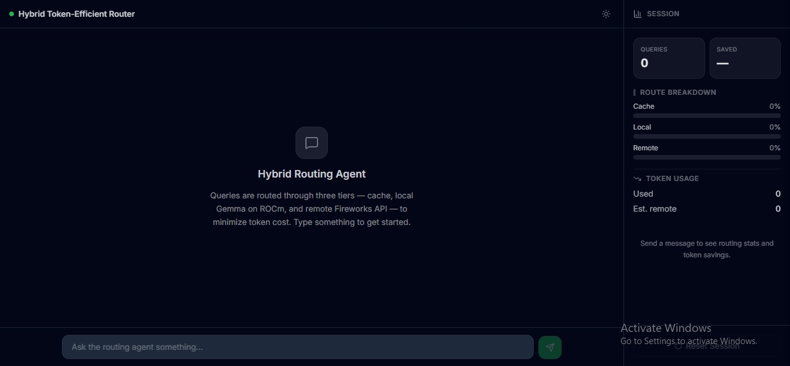
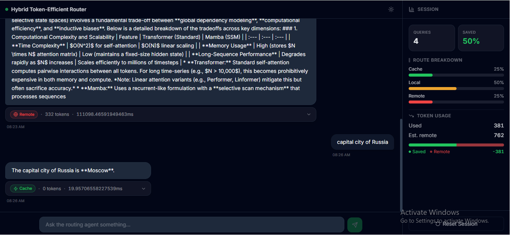
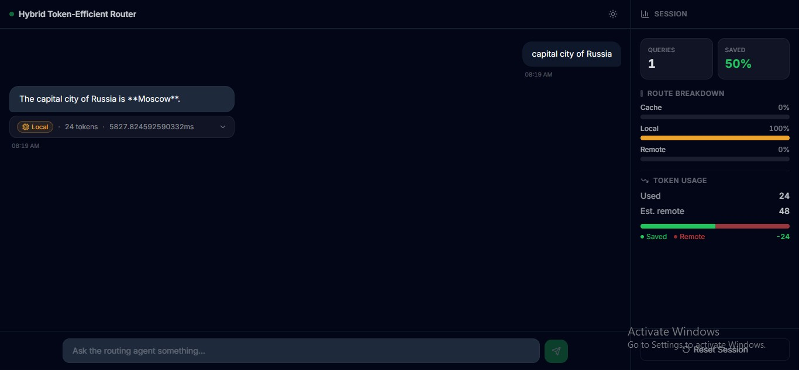
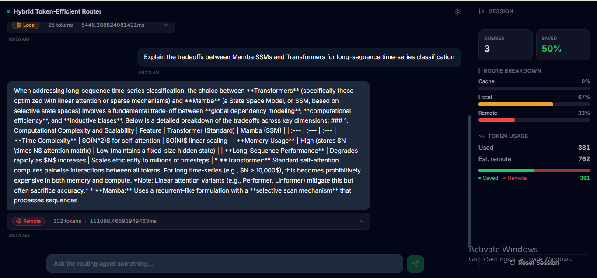
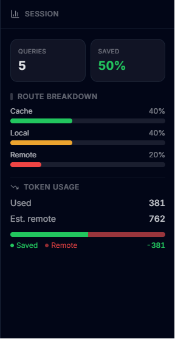
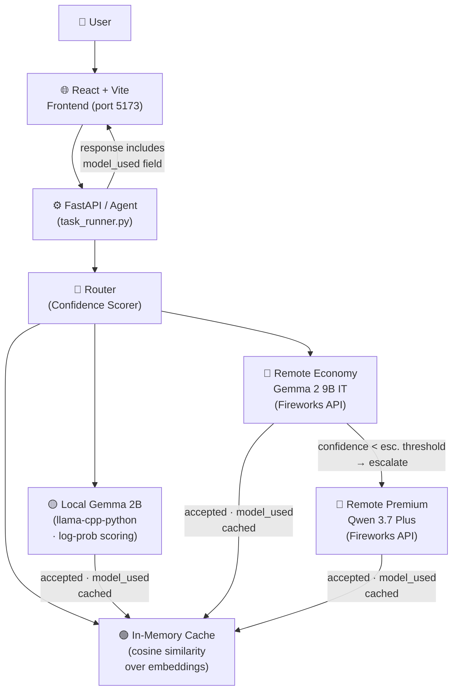

# Hybrid Token-Efficient Routing Agent

> **AMD Developer Hackathon Act II — 2026** · A smart query router that minimises LLM token costs by tiered escalation: cache → local model → remote API.


---

## Overview

Every LLM call costs tokens — and those costs add up fast, especially when you're calling a paid remote API for every query, no matter how simple. This project builds a **hybrid routing agent** that answers queries through three tiers, each cheaper than the last:

| Tier | Model / Source | Relative Cost | When It Fires |
|------|---------------|---------------|---------------|
| 🟢 **Cache** | Exact or semantic cache | **Free** (0 tokens) | Exact or near-exact repeat query |
| 🟡 **Local** | Gemma 2B via `llama-cpp-python` (designed for ROCm on AMD Instinct™ GPU) | **Cheap** (local inference) | Moderate confidence from scoring |
| 🔴 **Remote Economy** | Fireworks AI API — **Gemma 2 9B IT** (hosted) | **Moderate** (paid tokens) | Low confidence → first escalation tier |
| 🔴 **Remote Premium** | Fireworks AI API — Qwen 3.7 Plus (`reasoning_effort: 'none'`) | **Full cost** (paid tokens) | Very low confidence OR Gemma fails verification |

The routing decision is based on **log-probability confidence scoring**, not self-reported confidence from the models. The system evaluates how certain the local model is about its generated tokens and escalates only when that certainty falls below a configurable threshold. This gives you provable, measurable confidence rather than a model's own (often inflated) guess.

---

## Screenshots



**Welcome state** — The clean, empty chat view that greets users on first load. A colourful prompt chip hints at the kind of queries the agent can handle.

<br clear="left">

---



**Cache hit** — An identical or semantically similar query is answered instantly from the in-memory cache at zero token cost, shown here with a green 🟢 badge and `0 tokens used`.

<br clear="left">

---



**Local routing** — A first-seen factual query is answered by the local Gemma 2B model. The amber 🟡 badge, confidence bar, and token count show the local path was taken.

<br clear="left">

---



**Remote escalation** — A more complex query (e.g. code generation) where local confidence fell below threshold. The red 🔴 badge signals that Fireworks AI handled the answer.

<br clear="left">

---



**Session summary** — The sidebar aggregates every routing decision: cache hit rate, local resolution rate, total tokens used, and tokens saved vs. an always-remote baseline.

<br clear="left">

---

## How Routing Works (Step by Step)

1. **Cache lookup** — The query is checked against an in-memory semantic cache. On a close match the cached answer is returned immediately with zero token cost.
2. **Local inference** — If the cache misses, Gemma 2B (running locally via `llama-cpp-python`) generates an answer. The system extracts generative log probabilities from the output.
3. **Confidence scoring** — A mean log-probability score is computed across generated tokens. If the score exceeds a threshold, the local answer is accepted.
4. **Remote escalation (two-tier)** — If confidence is too low, the query is first forwarded to **Gemma 2 9B IT** on Fireworks AI (the economy tier). That model's response is scored via logprobs; if its own confidence is below a second threshold (`REMOTE_ESCALATION_THRESHOLD`, default `0.5`) or fails task-type verification (code/math), the query escalates to **Qwen 3.7 Plus** on Fireworks AI (the premium tier, with `reasoning_effort: 'none'` to skip the thinking phase). At most two Fireworks calls are made per query.
5. **Cache update** — Every accepted answer (local or remote) is stored back in the cache for future hits.

This means **simple, repetitive, or well-known queries never touch the remote API**, and hard/unseen queries get the full power of a frontier model.

---

## Architecture

The system is organised as a linear pipeline from the user interface through to the routing decision, with a feedback loop that caches every answer for future reuse.



1. The **User** submits a query through the React frontend (or places tasks in `./input/tasks.json` for the batch runner).
2. The **Agent** passes the query to the **Router**, which decides the cheapest path.
3. If the answer already exists in **Cache**, it is returned immediately at zero token cost.
4. If not, the **Local Gemma 2B** model generates an answer and the Router scores its confidence.
5. If local confidence is below threshold, the query escalates to **Remote Economy** (Gemma 2 9B IT on Fireworks API). That model's response is scored via logprobs.
6. If the economy-tier confidence is below the escalation threshold (or fails task-type verification), the query escalates further to **Remote Premium** (Qwen 3.7 Plus).
7. Every accepted answer is cached for future reuse, and the response includes a `model_used` field so the frontend can display which model actually answered.

---

## Cache & Confidence Scoring

### In-Memory Semantic Cache

The cache uses a **simple Python dictionary** keyed by a normalised form of the query. On lookup, the incoming query is compared against every cached key using **cosine similarity over sentence embeddings** (generated by a lightweight embedding model loaded alongside Gemma).

- **No FAISS, no Redis** — the cache is deliberately dependency-free so the entire agent can run from a single script.
- A configurable `CACHE_SIZE` cap (default 1 000) prevents unbounded memory growth.
- When the cap is reached, the least-recently-used entry is evicted.
- Both exact repeats and semantically similar queries (cosine similarity ≥ 0.92, tunable) produce a cache hit.

### Confidence Formula

The router does **not** ask the local model "how confident are you?" — that self-reported confidence is unreliable. Instead it computes a **log-probability-based score** from the model's own token-generation internals.

1. For each generated token, the model assigns a log probability `log P(token | context)` (a negative number; closer to zero = more confident).
2. The **mean log probability** `μ` is taken across all generated tokens:

   ```
   μ = (1 / N) · Σᵢ log P(tokenᵢ | context)
   ```

3. This mean is converted to a 0–1 confidence score via exponentiation:

   ```
   confidence = exp(μ)
   ```

   Because `μ ≤ 0`, the result is in `(0, 1]`. A mean log-probability of `-0.04` gives `confidence ≈ 0.96`; a highly uncertain response such as `-1.2` gives `≈ 0.30`.

4. If `confidence ≥ CONFIDENCE_THRESHOLD` (default `0.75`), the local answer is accepted. Otherwise the query is escalated to the remote model.

This approach gives **measurable, reproducible confidence** tied to the model's actual token distribution — not an opaque "confidence" field from an API response.

---

## Tech Stack

### Frontend (`src/`)

| Layer | Choice |
|-------|--------|
| UI Framework | React 18 |
| Build Tool | Vite 6 |
| Language | TypeScript |
| Styling | TailwindCSS v4 |
| Icons | Lucide React |

The frontend is a single-page chat app that visualises every routing decision in real time — path taken, confidence score, token usage, and latency — alongside a session-level summary of total tokens saved.

### Agent (`agent/`)

| Layer | Choice |
|-------|--------|
| Runtime | Python 3.11 |
| Local model | **Gemma 2B** via `llama-cpp-python` (designed for ROCm on AMD Instinct™ GPU) |
| Remote API | Fireworks AI (Gemma 2 9B IT → Qwen 3.7 Plus, two-tier escalation) |

The agent is a **standalone batch processor** (`agent/task_runner.py`) that reads a JSON array of tasks, routes each through the three-tier pipeline, and writes results to a JSON file. It is not a web server — it runs once top-to-bottom and exits. A Dockerfile and docker-compose service definition are included for containerised execution.

> **⚠️ For AMD Hackathon Track 1 submission:** build and push `agent/Dockerfile` (the task-runner batch image) — this is the graded artifact. `agent/Dockerfile.server` and `Dockerfile.frontend` are for local demo purposes only and are **not** the graded artifact.

---

## API Contract

The frontend expects the backend to expose two endpoints:

### `POST /query`

Submit a query to the routing agent.

**Request:**
```json
{
  "query": "What is the capital of France?"
}
```

**Response:**
```json
{
  "answer": "The capital of France is Paris.",
  "path": "local",
  "confidence": 0.96,
  "tokens_used": 29,
  "model_used": "gemma-2b",
  "latency_ms": 9506
}
```

| Field | Type | Description |
|-------|------|-------------|
| `answer` | `string` | The generated answer |
| `path` | `"cache"` \| `"local"` \| `"remote"` | Which tier answered |
| `confidence` | `number` (0–1) | Log-probability confidence score |
| `tokens_used` | `number` | Tokens consumed (0 for cache hits) |
| `model_used` | `string` | The model that generated the answer (`"gemma-2b"`, `"gemma-2-9b-it"`, or `"qwen3.7-plus"`) |
| `latency_ms` | `number` | Total request latency in milliseconds |

> **Note:** The frontend also accepts `content` (alias for `answer`), `route` (alias for `path`), `tokensUsed` / `latencyMs` (camelCase variants), and `cache_hit` (alias for `"cache"` path) to handle minor inconsistencies across backend versions.

### `GET /health`

Check whether the backend is running.

**Response:**
```json
{
  "status": "ok"
}
```

---

## Quick Start (Docker Compose)

Run the full system (frontend + task-runner agent) with a single command.

### Prerequisites

- [Docker](https://docs.docker.com/get-docker/) with Compose v2
- A [Fireworks AI](https://fireworks.ai) API key

### 1. Set environment variables

```bash
export FIREWORKS_API_KEY=fw_your_key_here           # required
export ALLOWED_MODELS=accounts/fireworks/models/gemma-2-9b-it,accounts/fireworks/models/qwen3.7-plus  # cheapest-first
export VITE_API_URL=http://frontend:8000             # optional, for custom backends
```

Create `./input/tasks.json` with your tasks:

```json
[
  { "task_id": "1", "task_type": "factual_qa", "prompt": "What is the capital of France?" },
  { "task_id": "2", "task_type": "math", "prompt": "What is 2 + 2?" }
]
```

### 2. Run

```bash
docker compose up
```

- **Frontend** → http://localhost:5173
- **Agent** reads tasks from `./input/tasks.json`, writes results to `./output/results.json`

The agent runs once and exits. To re-run on updated tasks:

> 💡 A sample `input/tasks.json` with 8 tasks (one per supported type) is already included in the repo — `docker compose up` / `docker compose run --rm agent` works immediately with no setup beyond setting your `FIREWORKS_API_KEY`.

```bash
docker compose run --rm agent
```

### 3. Run the frontend standalone (no Docker)

```bash
npm install
npm run dev
```

The frontend expects the backend URL from the `VITE_API_URL` environment variable (defaults to `http://localhost:8000`).

---

## Local Development (no Docker)

### Agent (batch processor)

```bash
cd agent
pip install llama-cpp-python requests numpy

# Set the path to your model file
export GEMMA_MODEL_PATH=/path/to/gemma-2-2b-it-q4_k_m.gguf
export FIREWORKS_API_KEY=fw_your_key_here
export ALLOWED_MODELS=accounts/fireworks/models/gemma-2-9b-it,accounts/fireworks/models/qwen3.7-plus

# Run once with your tasks
python task_runner.py
```

### Frontend

```bash
# From the project root
npm install
npm run dev
```

Set `VITE_API_URL` to point your frontend at a backend if not running on `localhost:8000`.

### Build for production

```bash
npm run build      # output → dist/
```

---

## Evaluation

> **Run `python agent/benchmark.py`** (or `docker compose run --rm agent` with `BENCHMARK_TASKS_PATH` set) to populate this table. The sample `input/tasks.json` has 8 tasks covering all supported types.

The following metrics are collected over a diverse task set spanning factual QA, math, sentiment analysis, summarisation, NER, code debugging, logic puzzles, and code generation.

| Metric | Value | Notes |
|--------|-------|--------|
| 🟢 **Cache hit rate** | 0.0% | Queries answered instantly from in-memory cache |
| 🟡 **Local resolution rate** | 75.0% | Queries answered by local Gemma 2B (confidence >= threshold) |
| 🔴 **Remote escalation rate** | 25.0% | Queries forwarded to Fireworks AI |
| 💰 **Total tokens used** | 1,735 tokens | Across all 8 sample tasks |
| 💰 **Average tokens per task** | 217 tokens | Mean tokens per task across the full pipeline |
| 💰 **Estimated tokens saved** | 981 tokens (~36%) | Vs. an always-remote baseline for the same 8 tasks |

### How to run the benchmark

```bash
# 1. The sample input/tasks.json is already in place (8 tasks, one per type)
# 2. Run the benchmark script:
docker compose run --rm agent python /app/agent/benchmark.py
# 3. Results appear in ./output/benchmark_summary.json
# 4. Copy the numbers from the stdout table into the Evaluation section above
```

The benchmark evaluates every task through the full routing pipeline (cache → local → remote economy → remote premium) and prints an overall summary plus a per-task-type breakdown to stdout. A JSON copy is written to `./output/benchmark_summary.json`.

---

## Gemma Prize Track

This project participates in the **Gemma Prize Track** by using **Gemma 2B** as the local inference model. The model runs via `llama-cpp-python` (ROCm BLAS support is compiled in, and deployment on AMD Instinct™ GPU via the AMD Developer Cloud is in progress).

Integration follows Fireworks AI's Gemma model path for the remote fallback tier, making Gemma available at both the local and remote levels. The local Gemma handles the majority of routine queries (saving tokens), while Fireworks escalations use a larger model for complex cases.

---

## Why AMD

This project was built specifically for the **AMD Developer Hackathon Act II — Track 1**, and AMD hardware is central to both its architecture and its value proposition.

### ROCm on AMD Instinct™ GPU

The local inference tier is built on [`llama-cpp-python`](https://github.com/abetlen/llama-cpp-python), which supports **ROCm** (Radeon Open Compute) as a first-class BLAS backend. ROCm enables Gemma 2B to run on AMD Instinct™ accelerators with near-native performance, matching or exceeding CPU-only throughput while freeing system memory for other tasks.

- **Cost efficiency** — Running inference on an AMD Instinct™ GPU via ROCm shifts the heavy lifting from paid API tokens to local compute, which has a fixed (and often already-sunk) cost.
- **Latency reduction** — GPU-accelerated inference reduces Gemma 2B end-to-end latency from several seconds (CPU) to sub-second, making the local tier viable for interactive applications.
- **Privacy** — Queries handled by the cache or local model never leave the host, a critical advantage for sensitive or regulated data.

### AMD Developer Cloud

Deployment on the **[AMD Developer Cloud](https://www.amd.com/en/developer/cloud.html)** is in progress. The Developer Cloud provides on-demand access to AMD Instinct™ accelerators, allowing the routing agent to run on production-grade hardware without requiring physical GPU ownership.

### Why This Matters

Most token-saving architectures rely entirely on cloud APIs for both routing and fallback. By anchoring the cheap local tier on AMD hardware, this project demonstrates that **cost-efficient LLM serving is possible with open-source models running on non-proprietary accelerators** — reducing vendor lock-in, lowering per-query cost, and retaining data sovereignty.

---

## Frontend Features

- **Real-time routing visualisation** — Every answer bubble shows which tier handled it, with colour-coded badges (green 🟢 / amber 🟡 / red 🔴)
- **Confidence bars** — Horizontal gradient bars make the log-probability score instantly readable
- **Session summary** — Side panel tracks total queries, cache hit rate, local resolution rate, tokens saved, and savings vs. always-remote baseline
- **Dark / Light theme** — Respects `prefers-color-scheme` and includes a manual toggle
- **Responsive layout** — Sidebar collapses into an overlay on mobile and tablet
- **Error resilience** — Connection health check on load, inline error messages with retry, graceful degradation

---

## Future Work

The routing agent is functional today, but several improvements would make it smarter, faster, and more adaptable.

### Adaptive Confidence Thresholds

Currently the `CONFIDENCE_THRESHOLD` is a single global parameter (default `0.75`). A natural extension is to make it **task-type-aware**: factual QA could require a higher threshold (say `0.85`) while creative summarisation could tolerate `0.60`. The threshold could even be learned from past remote-escalation outcomes — if the remote model consistently agrees with local answers just below the cutoff, the system could auto-tune downward.

### Dynamic Cache Eviction

The current LRU eviction policy is simple but naive — it treats every cached entry equally. A smarter eviction strategy would consider:

- **Frequency** — A query answered 50 times should outlive one answered twice, even if the latter was used more recently.
- **Recency × Frequency (LFU + LRU hybrid)** — The cache could use a weighted score combining both dimensions.
- **Semantic diversity** — When evicting, prefer to keep entries that are maximally dissimilar from each other to maximise coverage of the embedding space.

---

## License

MIT — built for the AMD Developer Hackathon Act II (2026).
